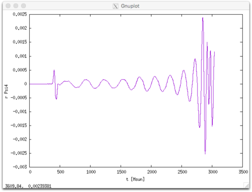

Neutron Star Merger Simulations: Tutorial
=========================================

This tutorial will guide you through the steps necessary to perform a binary
neutron star (NS) merger simulations with tabulated nuclear equation of state
(EOS) and neutrino leakage.

Changes
-------

* June 9, 2020. Removed discussion on the `mass_conversion` parameter, since it
is actually not needed when using the tables and scripts provided with
WhiskyTHC.

Downloading WhiskyTHC
---------------------

Download and unpack the WhiskyTHC core distribution with the commands

~~~
    $ wget http://personal.psu.edu/dur566/downloads/WhiskyTHC.tar
~~~

The tarball contains scripts and microphysics tables for WhiskyTHC. It does not
contain the actual source code, which is instead hosted on
[bitbucket](https://bitbucket.org).

Unpack the tarball with

~~~
    $ tar xvf WhiskyTHC.tar
    $ cd FreeTHC
~~~

Use the GetComponents utility to checkout Cactus and WhiskyTHC

~~~
    $ ./scripts/GetComponents --parallel thornlists/full.th
~~~

This will download [Cactus](http://cactuscode.org/),
[Carpet](http://carpetcode.org/), [CTGamma](https://bitbucket.org/llamacode/),
and [WhiskyTHC](http://personal.psu.edu/dur566/whiskythc.html) and
place them in a folder called `Cactus`. This will also download
[batchtools](http://bitbucket.org/dradice/batchtools), the set of scripts I use
to manage simulations.

GetComponents has some problem with the capitalization of repository names from
bitbucket, where WhiskyTHC is hosted. To workaround these issues, it is
necessary to run the `fixsymlinks.sh` script after `GetComponents`.

~~~
    $ ./scripts/fixsymlinks.sh
~~~

NOTE: `GetComponents` will place a copy of the thornlist used for the checkout
in `Cactus/thornlists`.

Compiling WhiskyTHC
-------------------

Detailed instructions on how to compile can be found in
`Cactus/doc/UsersGuide.pdf`. In brief, you need to load all necessary modules,
create a configuration, and then compile it.

Example of module lists for some of the machines I have compiled and run
WhiskyTHC can be found in the `Cactus/batchtools/templates/cactus` folder. If
you are using `bash` as login shell, you can load them with the `source`
command (in the `Cactus` folder):

~~~
    $ source batchtools/templates/cactus/comet.env
~~~

To create a configuration you will need to prepare a thornlist, that is a list
of components to be built, and a config file. An example of thornlist is the
`full.th` file, which contains everything I typically use in a production run.
Example of optionlists for some machines where I compiled and run WhiskyTHC can
be found in the `batchtools/templates/cactus` subfolder of Cactus.

For example, on SDSC Comet you can create a configuration

~~~
    $ yes | make thc THORNLIST=thornlists/full.th \
                     options=batchtools/templates/cactus/comet.cfg
~~~

If this command is successful you can then compile with

~~~
    $ make thc -j4
~~~

Microphysics Tables
-------------------

WhiskyTHC uses tabulated properties of NS matter. To run a simulation you will
need three tables:

1. A zero-temperature beta-equilibrated slice of the EOS to be used with
   [Lorene](http://www.lorene.obspm.fr/) to generate the binary initial data.
   You will also need a version of the same table in "Pizza" format which is
   used by WhiskyTHC to initialize the electron fraction from the Lorene data.

2. An equation of state table in HDF5 format to be used for the evolution.

3. A table with chemical potantials used to compute weak rates.

The format of these tables is documented in the code, see the
`THCExtra/EOS_Thermal_Table3d` and `THCExtra/WeakRates` thorns.
`THCExtra/tools/eos_table` contains scripts that can convert tables from
[stellarcollapse.org](https://sntheory.org/equationofstate) to the format used
by WhiskyTHC and can extract zero-temperature slices in Lorene and Pizza
format.

For this tutorial we will use the LS220 tables in the `Data/EOS/LS220` folder.

Initial Data
------------

Please refer to the [Lorene](http://www.lorene.obspm.fr/) documentation for how
to create new initial data. In this tutorial, we will use the initial data
distributed together with WhiskyTHC and available in the `Data/LoreneData`
folder. In particular, the instructions refer to the binary
`LS220_T001_13641364_45km` (LS220 EOS; initial temperature 0.01 MeV; 1.364 Msun
vs 1.364 Msun; initial separation 45 km) that can be found in the
`Data/LoreneData/GW170817/R01` folder. The same procedure can be used to run
other binaries.

Parameter File
--------------

The parameter file (parfile in brief) contains all necessary inputs to setup a
binary simulation.  In this tutorial we will use the example parfile
`parfiles/bns_gw170817_ls220_q1.par` distributed with WhiskyTHC. The parfile
starts with a list of modules (thorns in Cactus jargon) used for the
simulation:

~~~
    ActiveThorns = "
        ADMBase
        ...
    "
~~~

This is followed by the parameters for each thorn. You can find more details
about the parfile in the Cactus documentation `Cactus/doc/UserGuide.pdf` and
in the documentation of each thorn, which can be compiled with the command (in
the Cactus folder)

~~~
    $ make [ThornName]-ThornDoc
~~~

For example

~~~
    $ make THC_Core-ThornDoc
~~~

generates the file `doc/ThornDoc/THCCore/THC_Core/documentation.pdf`.

Here, I only give a summary of the first parameters you may want to play with.

This sets the maximum wallclock time:

~~~
    TerminationTrigger::max_walltime = @WALLTIME_HOURS@
~~~

At the end of this time the simulation will checkpoint and terminate. If you
use batchtools to manage your simulations `@WALLTIME_HOURS@` will be
automatically replaced when you create a segment according to the settings you
have chosen for batchtools.

The initial data file and EOS are set by

~~~
    PizzaIDBase::eos_file     = "@HOME@/FreeTHC/Data/EOS/LS220/0.01MeV/LS_220_25-Sept-2017.pizza"
    LoreneID::lorene_bns_file = "@HOME@/FreeTHC/Data/LoreneData/GW170817/R01/LS220_T001_13641364_45km/resu.d"
~~~

Again note that if you are using `batchtools` `@HOME@` will be replaced by the
path to your home directory and I am assuming that you checked out WhiskyTHC
there. You might need to adjust these paths if you have placed WhiskyTHC and/or
the Data distribution in another location.

The tables used for the evolution are set with the following instructions in
the parfile:

~~~
    EOS_Thermal_Table3d::eos_db_loc   = "@HOME@/FreeTHC/Data/EOS"
    EOS_Thermal_Table3d::eos_folder   = "LS220"
    EOS_Thermal_Table3d::eos_filename = "LS_220_hydro_27-Sep-2014.h5"
    WeakRates::table_filename         = "@HOME@/FreeTHC/Data/EOS/LS220/LS_220_weak_27-Sep-2014.h5"
~~~

The last section of the parfile is dedicated to selecting the output variables
and frequency and is self-explanatory.

Adaptive Mesh Refinement
------------------------

WhiskyTHC uses a simple adaptive mesh refinement (AMR) algorithm built on top
of the [Carpet](http://carpetcode.org/) infrastructure. In the Carpet AMR
model, the grid is constructed starting from a uniform, low-resolution,
Cartesian box.  Where higher resolution is required, the user can create
hierarchies of refinement levels made of nested boxes, with each level having
twice the resolution of the parent level (the level number 0 is the global
uniform grid).  Carpet supports the creation of a number of these hierarchies
that can have varying number of levels and position.

For NS merger simulations we use three hierarchies or regions:

* Regions 1 and 2, are centered on the position of the NS.

* Regions 3 is centered at the coordinate origin and includes both binaries;

The thorn `BNSTrackerGen` is responsible for moving the regions 1 and 2. During
the inspiral, region 3 only has few active refinement level boxes and is used
to resolve the gravitational wave (GW) "wave zone". Once the two NSs merger, we
switch off regions 1 and 2 and increase the number of levels in region 3 to
create high-resolution boxes that contain the whole merger remnant.

The size of the computational domain in code units (G = c = Msun = 1) and the
basic resolution are specified by

~~~
    CoordBase::xmin     = -1024
    CoordBase::xmax     =  1024
    CoordBase::ymin     = -1024
    CoordBase::ymax     =  1024
    CoordBase::zmin     =  0
    CoordBase::zmax     =  1024

    CoordBase::spacing  = "numcells"
    CoordBase::ncells_x = 128
    CoordBase::ncells_y = 128
    CoordBase::ncells_z = 64
~~~

For this particular run the resolution on the coarsest grid is 8 Msun = 11.81
km. For merger simulations we use 7 refinement levels (including level 0), so
the resolution in the region containing the NSs is 16 / 2^6 = 0.250 Msun = 369.2 m.
Note that this is half of the typical resolution we use in production simulations.

The AMR setup is specified by the `Carpet`, `CarpetRegrid2`, and
`BNSTrackerGen` options. The only parameters you might want to experiment with,
before becoming familiar with the inner working of the code, are the initial
positions of the two NS on the grid:

~~~
    CarpetRegrid2::position_x_1	= 15.2365094091
    CarpetRegrid2::position_x_2	= 15.2365094091
~~~

and the sizes of the innermost boxes, which should be large enough to cover the
entire NSs during the inspiral:

~~~
    CarpetRegrid2::radius_1[6] = 10.0
    CarpetRegrid2::radius_2[6] = 10.0
~~~

and the postmerger

~~~
    CarpetRegrid2::radius_3[6] = 10.0
~~~

Note that the leakage scheme also needs to know the position of the two NSs at
the initial time. This is because the neutrino optical depth is initially
estimated using two auxiliary spherical grids centered at the locations of the
NSs:

~~~
    THC_LeakageBase::center_grid1[0] = 15.2365094091
    THC_LeakageBase::center_grid2[0] = -15.2365094091
~~~

Running the Simulation
----------------------

On most supercomputers, simulations should be run in a special high-performance
file system that we assume to be called `$SCRATCH` in this tutorial.

First we create a folder for the simulation:

~~~
    $ cd $SCRATCH
    $ mkdir -p simulations/GW170817/LS220_M13641364
~~~

The simulation folder needs to be in a nested folder several levels below
`$SCRATCH`, because the Lorene initial data reader will look for the EOS table
in the folder `../../../Eos_tables` (relative to the working directory of the
simulation). For this reason, we also need to create a symbolic link in the
`$SCRATCH` folder:

~~~
    $ cd $SCRATCH
    $ ln -s $HOME/FreeTHC/Data/EOS/Lorene Eos_tables
~~~

We will use batchtools to create and run the simulation, to this aim we need to
add batchtools to the system `PATH`. If you are using bash, you can achieve this
with

~~~
    $ export PATH=$PATH:$HOME/FreeTHC/Cactus/batchtools/bin
~~~

This line can be added to your `$HOME/.bashrc` file to make batchtools
permanently available.

Now we are ready to setup the simulation

~~~
    $ cd $SCRATCH/simulations/GW170817/LS220_M13641364
    $ batchtools init \
        --parfile ~/FreeTHC/parfiles/bns_gw170817_ls220_q1.par \
        --exe ~/FreeTHC/Cactus/exe/cactus_thc \
        --batch ~/FreeTHC/Cactus/batchtools/templates/cactus/comet.sub
~~~

This will create a `BATCH` folder in the current directory. Please edit the
`BATCH/CONFIG` file to select the allocation you plan to use and other options.
See the [batchtools documentation](http://bitbucket.org/dradice/batchtools) for
more details. This example simulation require about 35 Gb of memory and should
be ideally run using between 64 and 256 CPU cores.

The last step is to create the first simulation segment and submit it to the queue:

~~~
    $ batchtools makesegment
    $ batchtools submit
~~~

This will create a folder `output-0000` which will be populated with the output
of the simulation once the job is run by the queue manager of the cluster
(e.g., SLURM). Subsequent restarts will be named as `output-0001`,
`output-0002`, etc. The separation of the run in multiple chunks is done for
safety reasons, because we do not want a bad file system write to corrupt
existing data and we want to be able to restart the simulation at intermediate
points if it is necessary to make adjustments.

Depending on how many cores you have allocated for this simulation, a full run
might require several restarts to reach the time of merger.

Analyze and Visualize Results
-----------------------------

Note that WhiskyTHC uses geometrized units with G = c = Msun = 1 (but
temperatures are given in MeV).

Some of the key diagnostics outputs from WhiskyTHC are:

* rho.maximum.asc   : maximum density (geometrized units)
* dens.norm1.asc    : total rest-mass density (excluded regions inside
                      event horizons) divided by the domain volume
* H.norm2.asc       : norm2 of the Hamiltonian constrain violation
* outflow_det_X.asc : flux of material crossing the detector sphere number X (specified in the parfile)
* mp_Psi4_l2_m2_r400.00.asc:
                      real and imaginary part of the l = m = 2 multipole of
                      the Weyl scalar Psi4 extracted at a radius r = 400 Msun.
* bnstrackergen-bns_positions:
                      output from the BNS tracker

For example here we plot the curvature gravitational wave using gnuplot:

~~~
    gnuplot> plot "<cat output-00??/data/mp_Psi4_l2_m2_r400.00.asc" u 1:($2*400) w l
~~~

This yields the following figure:

For more advanced analysis and visualization of WhiskyTHC results, I developed
two python packages:

* [scidata](https://bitbucket.org/dradice/scidata): utilities to read
Cactus/Carpet data into python for further analysis.
* [scivis](https://bitbucket.org/dradice/scivis): library of 2D visualization
scripts (uses scidata).

Please refer to the `README` files of those packages for instructions on how to
install and use them.

For complex visualizations, including 3D volume renderings, you can use
[VisIt](https://wci.llnl.gov/simulation/computer-codes/visit). VisIt already
includes a [plugin to read Cactus/Carpet
data](http://cactuscode.org/documentation/visualization/VisIt/).  Note that
this plugin can only handle correctly vertex-centered AMR data. It is still
possible to use it to visualize cell-centered AMR data with VisIt and with this
plugin, however this produces small, but visible, artifacts at refinement level
boundaries.
